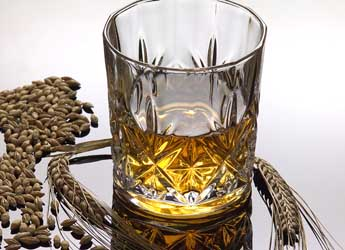

```{r setup, include=FALSE}
knitr::opts_chunk$set(echo = TRUE)

# Import R libraries
#====================
library(deSolve)
library(dplyr)
library(ggnetwork)
library(ggplot2)
library(googleVis)
op = options(gvis.plot.tag='chart')
library(igraph)
library(intergraph)
library(kableExtra)
library(knitr)
library(reshape2)
library(stringr)


# Load plant-pathogen interaction model data
#============================================
# These files are timecourse output from COPASI, but COPASI's header line 
# starts with the default comment character, so we need to lose this. 
# (possibly by manual editing)
nopathdata = read.table('data/ppi/no_path.txt', sep='\t', 
                        header=T, comment.char="")
pathdata = read.table('data/ppi/no_pti_no_supp_no_eti.txt', sep='\t', 
                      header=T, comment.char="")
ptidata = read.table('data/ppi/pti_no_supp_no_eti.txt', sep='\t', 
                     header=T, comment.char="")
ptietsdata = read.table('data/ppi/pti_supp_no_eti.txt', sep='\t', 
                        header=T, comment.char="")
ptietsetidata = read.table('data/ppi/pti_supp_eti.txt', sep='\t', 
                           header=T, comment.char="")

# Reshape all five datasets and lose the columns we're not interested in
dflist = list(nopath=nopathdata, noresponse=pathdata, 
              pti=ptidata, ptiets=ptietsdata, 
              ptietseti=ptietsetidata)
dflist = lapply(dflist, function(df) {
  colnames(df)[1] = "Time"
  colnames(df)[7] = "Pathogen"
  df = melt(df, id=c("Time"))
  df = df[df$variable %in% c("Callose", "Pathogen"),]
})

# Bind all our data into a single dataframe
data = do.call(rbind, dflist)
# Convert row.names to run names
vals = 402  # How many rows per run?
data$runtype = c(rep("No Pathogen", vals), rep("No Response", vals), 
                 rep("PTI", vals), rep("PTI+ETS", vals), 
                 rep("PTI+ETS+ETI", vals))
                 
# We assume that the model reaches a steady-state (or near enough), by
# Time=200s, and just pull out those values
ssdata = data[data$Time==200,]


# Define plant-pathogen interaction model
#=========================================
ppi_model = function(t, state, parameters) {
  with(as.list(c(state, parameters)), {
  dPAMP = -(k1 * PAMP) - (k2f * PRR * PAMP) + (k2r * PRRstar) + (k3 * Path)
  dPRRstar = (k2f * PRR * PAMP) - (k2r * PRRstar)
  dPRR = - (k2f * PRR * PAMP) + (k2r * PRRstar)
  dR = -(k4f * R * Eint) + (k4r * Rstar)
  dRstar = k4f * R * Eint - k4r * Rstar
  dE = -(k14 * E) - ((v6 * E) / (km6 + E + (km6 * Callose) / ki6)) + k15 * Path
  dEint = -(k4f * R * Eint - k4r * Rstar) + ((v6 * E) / (km6 + E + (km6 * Callose) / ki6)) - (k5 * Eint)
  dCallose = -(k7 * Callose * Eint) - (k8 * Callose) + (k9 * PRRstar)
  dPath = -(k10 * Path * Callose) + (k11 * Pathbulk) - (k12 * Path * Rstar) - (k13 * Path)
  list(c(dPAMP, dR, dRstar, dEint, dCallose, dPath, dPRRstar, dPRR, dE))
  })
}

# Define initial conditions
state = c(PAMP = 0, R = 1, Rstar = 0, Eint = 0, Callose = 0, Path = 0, PRRstar = 0, PRR = 1, E = 0)

# Define length of timecourse
maxtime = 100
times = seq(0, maxtime, by = 0.01)

# Define parameters for specific scenarios
# 1) No pathogen present
nopath = c(k1 = 0.1, k2f = 0.1, k2r = 0.1, k3 = 0.1, k4r = 0.1, k4f = 0.1, k5 = 0.1,
           v6 = 0.1, km6 = 0.1, ki6 = 0.1, k7 = 0.1, k8 = 0.1, k9 = 0.1, k10 = 0.1,
           k11 = 0.1, k12 = 0.1, k13 = 0.1, k14 = 0.1, k15 = 0.1, Pathbulk = 0)
# 2) Pathogen present, but no plant response
pathonly = c(k1 = 0.1, k2f = 0.0, k2r = 0.0, k3 = 0.1, k4r = 0.0, k4f = 0.0,
             k5 = 0.1, v6 = 0.1, km6 = 0.1, ki6 = 0.1, k7 = 0.1, k8 = 0.1, k9 = 0.1,
             k10 = 0.1, k11 = 0.1, k12 = 0.1, k13 = 0.1, k14 = 0.1, k15 = 0.1, Pathbulk = 1)
# 3) Pamp-triggered immunity (PTI) only
pti = c(k1 = 0.1, k2f = 0.1, k2r = 0.1, k3 = 0.1, k4r = 0.0, k4f = 0.0, k5 = 0.1,
        v6 = 0.1, km6 = 0.1, ki6 = 0.1, k7 = 0.0, k8 = 0.1, k9 = 0.1, k10 = 0.1,
        k11 = 0.1, k12 = 0.1, k13 = 0.1, k14 = 0.1, k15 = 0.1, Pathbulk = 1)
# 4) PTI, and effector-triggered susceptibility (ETS)
pti_ets = c(k1 = 0.1, k2f = 0.1, k2r = 0.1, k3 = 0.1, k4r = 0.0, k4f = 0.0, k5 = 0.1,
            v6 = 0.1, km6 = 0.1, ki6 = 0.1, k7 = 0.1, k8 = 0.1, k9 = 0.1, k10 = 0.1,
            k11 = 0.1, k12 = 0.1, k13 = 0.1, k14 = 0.1, k15 = 0.1, Pathbulk = 1) 
# 5) PTI, ETS, and effector-triggered immunity (ETI)
pti_ets_eti = c(k1 = 0.1, k2f = 0.1, k2r = 0.1, k3 = 0.1, k4r = 0.1, k4f = 0.1, k5 = 0.1,
                v6 = 0.1, km6 = 0.1, ki6 = 0.1, k7 = 0.1, k8 = 0.1, k9 = 0.1, k10 = 0.1,
                k11 = 0.1, k12 = 0.1, k13 = 0.1, k14 = 0.1, k15 = 0.1, Pathbulk = 1)

# Run the scenario models
#=========================
# 1
out_nopath = as.data.frame(ode(y = state, times = times,
                               func = ppi_model, parms = nopath))
out_nopath$run = "no pathogen"                               
# 2
out_pathonly = as.data.frame(ode(y = state, times = times,
                                 func = ppi_model, parms = pathonly))
out_pathonly$run = "no defence"                                 
# 3
out_pti = as.data.frame(ode(y = state, times = times,
                            func = ppi_model, parms = pti))
out_pti$run = "PTI"                            
# 4
out_pti_ets = as.data.frame(ode(y = state, times = times,
                                func = ppi_model, parms = pti_ets))
out_pti_ets$run = "PTI + ETS"
# 5
out_pti_ets_eti = as.data.frame(ode(y = state, times = times,
                                    func = ppi_model, parms = pti_ets_eti))
out_pti_ets_eti$run = "PTI + ETS + ETI"                        

# Combine scenarios into a single dataframe
out_df = rbind(out_nopath, out_pathonly, out_pti, out_pti_ets, out_pti_ets_eti)
out_df$run = as.factor(out_df$run)


# SRE Taxonomy Sankey Plots
#===========================

# Reclassified isolates
genus = read.table("data/dickeya/genus_sankey.csv", sep=",", header=TRUE)
species = read.table("data/dickeya/species_sankey.csv", sep=",", header=TRUE)
gcs = read.table("data/dickeya/genus_class_species.csv", sep=",", header=TRUE)

# Relationships between historical taxonomic classifications
sretaxdata = data.frame(origin=c(rep('E. carotovora', 3),
                                 'E. chrysanthemi',
                                 rep('P. carotovorum', 2),
                                 'P. atrosepticum',
                                 'P. wasabiae',
                                 rep('P. chrysanthemi', 6)),
                        renamed=c('P. carotovorum',
                                  'P. atrosepticum',
                                  'P. wasabiae',
                                  'P. chrysanthemi',
                                  'P. c. subsp. carotovorum (Pcc)',
                                  'P. c. subsp. brasiliense (Pcb)',
                                  'P. atrosepticum (Pba)',
                                  'P. wasabiae (Pwa)',
                                  'D. dianthicola',
                                  'D. dadantii',
                                  'D. zeae',
                                  'D. chrysanthemi',
                                  'D. dieffenbachiae',
                                  'D. paradisiaca'),
                        weights=c(6, 6, 6, 6,
                                  rep(3, 2),
                                  rep(6, 2),
                                  rep(1, 6)))
```

<!--
SECTION 1: The Hutton
-->

# 1. The James Hutton Institute

## The James Hutton Institute


<div class="col2" height="600px">
- formed from Scottish Crop Research Institute (`SCRI`) and Macaulay Land Use Research Institute (`MLURI`) in 2011
- main sites: Dundee, Aberdeen
- also: Glenshaugh, Balruddery, Hartwood
- oversees Biomathematics and Biostatistics Scotland (BioSS)
- University of Dundee Division of Plant Sciences based at Dundee site
- <div class="attention">**applied focus (policy)**</div>

<p>

</p>
</div>

<div class="references">
- [Hutton Highlights, February 2018](http://www.hutton.ac.uk/sites/default/files/files/publications/e-magazine/HuttonHighlightsFebruary2018/index.html)
</div>


<!--
SECTION 2: Plant-pathogen interactions
-->

# 2. Plant-Pathogen Interactions

## A Global Challenge

<div class="col2">
- feed **9.2bn people** (86% in developing world) by 2050
- **double food production** in 50yr
- food losses to pathogens:
    - **10-25%** of planted crops
    - **10%** of post-harvest crops
    - (enough to feed >2bn people, 2kcal/day)
- pathogens moving polewards
- severe threats to ecosystem services

<p>

<br />

</p>
</div>

<div class="references">
- [Fisher *et al.* (2012) *Nature* doi:10.1038/nature10947](http://dx.doi.org/10.1038/nature10947): Emerging fungal threats
- "Prediction for Biological Hazards" [https://www.gov.uk/government/publications/biological-hazards-prediction](https://www.gov.uk/government/publications/biological-hazards-prediction)
- [Bebber *et al.* (2014) *Global Ecol. Biog.* doi:10.1111/geb.12214](https://dx.doi.org/10.1111/geb.12214): Global pest/pathogen distribution
- [Bebber *et al.* (2014) *New Phytol.* doi:10.1111/nph.12722](https://dx.doi.org/10.1111/nph.12722): Global pest/pathogen distribution
</div>

## Challenges in Scotland

<div class="col2">
- **food security**
    - burden, cost of crop disease
    - emerging pathogens (imports, climate change)
- **environmental sustainability**
    - pesticide minimisation, withdrawal
    - durable resistance *via* breeding (and/or GM)
- £308m cereals
- £258m other crops (£171m potatoes)
- £264m horticulture

<p>


<br />


<br />


<br />


</p>
</div>

<div class="references">
- [Outputs from Scottish Farms, 2015-16](http://www.gov.scot/Publications/2017/01/1031/337846)
</div>

## Key Potato Pathogens

<div class="col2">
<div class="highlight">
**Soft rot enterobacteria**
</div>

- *Pectobacterium* spp., *Dickeya* spp., *Erwinia* spp.
- many species, host ranges
- plant cell wall degrading enzymes
- rots plants in field, tubers in storage
- €30m/yr losses in Netherlands
- *P. atrosepticum* main cause of blackleg in Scotland
- *D. solani* recently emerged, very aggressive

<div class="highlight">
**Potato late blight**
</div>

- *Phytophthora infestans*
- Global problem
- estimated $6bn/yr cost worldwide
- UK costs ≈£55m/yr in losses, ≈£70m/yr in control
- requires frequent pesticide application (incl. for organics)
- (related spp. cause extensive damage to trees: larch, oak, juniper)
</div>

<div class="references">
- [Science and Advice for Scottish Agriculture (SASA)](https://www.sasa.gov.uk/diagnostics/bacteriology)
</div>

## How do pathogens infect?

<center>

</center>

<div class="references">
- [Dodds & Rathjen (2010) *Nature* doi:10.1038/nrg2812](https://dx.doi.org/10.1038/nrg2812) - plant-pathogen interaction mechanisms
</div>


<!--
SECTION 3: Blueprints?
-->

# 3. Blueprints?

## Blueprint

> ˈbluːprɪnt
>
>*noun*
>
>1. a design plan or other technical drawing.
>
>    "they are redrawing office blueprints to include large shared spaces"
>
>    synonyms:	plan, design, diagram, map, layout, representation

<div class="highlight">
**A pathogen's genome can be a static parts list or plan: *a blueprint***
</div>

<center>

</center>


## Parts lists are useful

<div class="col2">

- Gene or pathway presence/absence implies functional and/or phenotypic differences
  - differences in pathogenicity/virulence
  - taxonomic markers (16S, ITS1, VNTR, MLST)
<p>
<center>

</center>
</p>
</div>

<div class="attention">
**markers identify (latently) infected material for quarantine or destruction**
</div>

<div class="references">
- [Pritchard *et al.* (2006) *Bioinformatics* doi:10.1093/bioinformatics/btk021](https://dx.doi.org/10.1093/bioinformatics/btk021) - `GenomeDiagram` genome visualisation
- [Holden *et al.* (2009) *FEMS Microbiol. Rev.* doi:10.1111/j.1574-6976.2008.00153.x](https://dx.doi.org/10.1111/j.1574-6976.2008.00153.x) - comparative genomics of plant pathogens
</div>

# 3a. Diagnostics

## Diagnostics & Classification

<div class="col2">
- Scottish Government-funded
- Sonia Humphris
- Ian Toth
- Emma Campbell

<p>


</p>
</div>

<div class="highlight">
- RD2.1.4: classification
- RD2.1.5: diagnostics
- ScotGov: source tracking
- SSCR: historical isolate sequencing
</div>

<div class="footer">

</div>


## Legislation is Taxonomy-Based

<div class="attention">
**European and Mediterranean Plant Protection Organisation (EPPO)**

- member states should regulate *D. dianthicola* and *E. amylovora* as quarantine pests (A2 list)
</div>

<div class="highlight">
**Seed Potatoes (Scotland) Amendment Regulations (2010)**

- *zero tolerance* policy for all *Dickeya* spp. on potatoes in Scotland to ensure production of `clean' (disease-free) seed potato production for export
</div>

- Require a quick, cheap, scalable, preferably on-site, test (qPCR)

<br />consortium for control and epidemiology


## SRE Taxonomy

- enterobacterial taxonomy is difficult to resolve, in general

<div class="attention">
**Historical classification mostly phenotypic, polyphasic**
</div>
- all SRE originally *Erwinia* (1950s - bucket classification)
- now three distinct genera (*Erwinia*, *Dickeya*, *Pectobacterium*)
- binomial nomenclature not designed for large amounts of genome data, or metadata curation

<div class="highlight">
- old names hold over in literature, collections
- name discontinuities affect analyses, databases
</div>

<div class="references">
- [Czajkowski *et al.* (2015) *Ann. Appl. Biol.* doi:10.1111/aab.12166](https://dx.doi.org/10.1111/aab.12166) - SRE diagnostics
</div>


## Historical Taxonomy

- *Erwinia* revised ≈1953 (*Pectobacterium*), ≈2003-2005 (*Dickeya*)

<center>
```{r sre_taxonomy, echo=FALSE}
shinyApp(
  ui = fluidPage(
         fluidRow(column=12,
          htmlOutput("Sankey")
         )
       ),
  server = function(input, output) {
    output$Sankey = renderGvis({
      gvisSankey(sretaxdata,
                 from='origin', to='renamed',
                 weight='weights',
                 options=list(height=400, width=900,
                              sankey="{
                                link: { color: { fill: '#e8aabf',
                                                 fillOpacity: 0.7} },
                                        node: { colors: [ '#a61d4c' ],
                                                label: {fontSize: 10,
                                                        italic: true,
                                                        color: '#871b47'}} 
                                      }")
                            )
    })
  }
)
```
</center>

<div class="references">
- [Gardan *et al.* (2003) *Int. J. Sys. Microbiol.* doi:10.1099/ijs.0.02423-0](https://dx.doi.org/10.1099/ijs.0.02423-0) - SRE reclassification
- [Samson *et al.* (2005) *Int. J. Sys. Microbiol.* doi:10.1099/ijs.0.02791-0](https://dx.doi.org/10.1099/ijs.0.02791-0) - SRE reclassification
</div>


## Consequences of Misclassification

<div class="attention">
**Real-world impacts of misclassification**

- **False positives (type I errors):**
    - clean samples rejected: economic cost
    - farms quarantined/closed: economic/societal cost
- **False negatives (type II errors):**
    - (irreversible) introduction of infectious material
    - potential for novel host jumps and spread
</div>

<div class="references">
- [Pritchard *et al.* (2016) *Anal. Methods* doi:10.1039/c5ay02550h](https://dx.doi.org/10.1039/c5ay02550h) - SRE classification
</div>


## Whole-Genome Diagnostics Design

1. Collect available genomes for a class (and near neighbours)
2. Bulk-predict primers on all genomes (`Primer3`)
3. Predict cross-amplification *in silico* - intensive, parallelised
4. Evaluate *in vitro* against panel of unseen isolates

<center>

</center>

<div class="references">
- [Pritchard *et al.* (2012) *PLoS One* doi:10.1371/journal.pone.0034498](https://dx.doi.org/10.1371/journal.pone.0034498) - bulk diagnostic qPCR primer design (*E. coli*)
</div>


## `find_differential_primers`/`pdp`

<div class="highlight">
**`python` package and scripts for diagnostic primer design**
</div>

<div class="col2">
- design primers with Primer3
- include/exclude genomic regions
- diagnostic primers/metagenomic markers
- `pdp` parallelises under SGE/OGE

<p>

</p>
</div>

<div class="attention">
**Plant pathogen-specific primers designed with `pdp` have been used across Europe to identify *Dickeya* in the field**
</div>

<div class="references">
- [`https://widdowquinn.github.io/find_differential_primers/`](https://widdowquinn.github.io/find_differential_primers/)
- [Pritchard *et al.* (2013) *Plant Path.* doi:10.1111/j.1365-3059.2012.02678.x](https://dx.doi.org/10.1111/j.1365-3059.2012.02678.x) - bulk diagnostic qPCR primer design (SRE)
</div>


## Precise Classification

<div class="attention">
**Designed primers at subserotype level for *E. coli* O104:H4 outbreak**
</div>

<center>

</center>

- needs two primers for discrimination
- distinguishes historical O104:H4 from 2011 outbreak

<div class="references">
- [Pritchard *et al.* (2012) *PLoS One* doi:10.1371/journal.pone.0034498](https://dx.doi.org/10.1371/journal.pone.0034498) - bulk diagnostic qPCR primer design (*E. coli*)
</div>


# 3b. Improving assemblies

## riboSeed

<div class="col2">
- **Nick Waters**
- Fiona Brennan
- Florence Abram
- Ashleigh Holmes
- part of larger project on environmental *E. coli*

<p>


</p>
</div>

<div class="highlight">
- NUI Galway
- Teagasc
</div>

<div class="footer">


</div>

## Short Reads and Repeats

<div class="attention">
- most genome sequencing is (still for now) short read Illumina
- reads shorter than repeat sequence $\implies$ repeats not resolved
</div>

<center>

</center>


## 16S Metabarcoding

<div class="highlight">
**16S central to microbial ecology** (microbiome) **and identification**

- universal, essential structural RNA - low variation
- all 16S metabarcoding methods rely on reference databases/genomes
</div>

- bacteria commonly have several repeated very similar copies
- 16S does not assemble well: many published genomes collapse 16S

<center>

</center>


## rDNA differences

<div class="attention">
**rDNA flanking regions differ within a genome, not between genomes**
</div>

<center>


</center>

<div class="highlight">
- identify 16S clusters from related bacteria
- 'pin' unique reads to the corresponding reference cluster (anchoring)
- distribute common reads among all clusters (bridging)
</div>


## riboSeed Graphical Overview

<center>

</center>

<div class="references">
- [Waters *et al.* (2018) *Nucl. Acids Res.* doi:10.1093/nar/gky212](https://dx.doi.org/10.1093/nar/gky212): riboSeed manuscript
</div>


## riboSeed Performance

<div class="attention">
**hybrid (PacBio/Illumina assembly reference): 4x rDNA**

- Illumina-only *de novo* asm: 1/4; *de fere novo* riboSeed asm: 4/4
- 9 SNPs with respect to hybrid assembly (128 SNPs in reference)

**riboSeed enables closed scaffold of Illumina-only *Staphylococcus aureus* UAM-1 draft genome**
</div>

<center>

</center>

<div class="references">
- [Waters *et al.* (2018) *Nucl. Acids Res.* doi:10.1093/nar/gky212](https://dx.doi.org/10.1093/nar/gky212): riboSeed manuscript
- [https://nickp60.github.io/riboSeed/](https://nickp60.github.io/riboSeed/): riboSeed on GitHub
</div>


<!--
SECTION 4: Recipes?
-->


# 4. Recipes?

## Recipe

> ˈrɛsɪpi
>
>*noun*: recipe; *plural noun*: recipes
>
>1. a set of instructions for preparing a particular dish, including a list of the ingredients required.
>
>    "a traditional Yorkshire recipe"
>
>    synonyms:	cooking directions

<div class="highlight">
**If sufficiently well understood, a genome may become instructions for producing an organism: *a recipe***
</div>

<center>

</center>

## How do pathogens infect?

<div class="highlight">
**complex parts lists are the *what*, not the *how* - systems biology needed**
</div>

<center>

</center>

<div class="references">
- [Block *et al.* (2008) *Curr. Op. Plant Biol.* doi:10.1016/j.pbi.2008.06.007](https://dx.doi.org/10.1016/j.pbi.2008.06.007) - plant-bacterium interactions
</div>


## Models Guide Thinking

<div class="attention">
Prevailing interaction model: "Zig-Zag"
</div>

<div class="col2">
- **1. plant detects pathogen (PTI)**
- **2. pathogen produces *effector* (ETS)**
- **3. plant detects effector (ETI)**
- model is ***evolutionary***
- not a dynamic interaction
- not a specific timescale
- not a specific biological scale
- qualitative only
<br />


</div>

<div class="references">
- [Pritchard & Birch (2011) *Plant Sci.* doi:10.1016/j.plantsci.2010.12.008](http://dx.doi.org/10.1016/j.plantsci.2010.12.008): Systems biology of plant-pathogen interactions
</div>

## Dynamic (Toy) Model

<div class="attention">
Quantitative, specific timescales and molecular interactions
</div>


<div class="references">
- [Pritchard & Birch (2014) *Mol. Plant Pathol.* doi:10.1111/mpp.12210](http://dx.doi.org/10.1111/mpp.12210): Dynamic model of plant-pathogen interaction
- [BIOMD0000000563](https://www.ebi.ac.uk/biomodels-main/BIOMD0000000563): model at BIOMODELS
</div>


## Dynamic (Toy) Model

```{r, echo = FALSE}

shinyApp(
  ui = fluidPage(
    sidebarLayout(
      sidebarPanel(
        selectInput("var", label = "Variable:",
                    choices = c("Path", "Callose", "PAMP", "E", "Eint"), selected = "Path"),
        sliderInput("sens_pamp", label = "PTI sensitivity:",
                    min = 0.0, max = 1, value = 0.0, step = 0.1),
        sliderInput("sens_eff", label = "ETI sensitivity:",
                    min = 0.0, max = 1, value = 0.0, step = 0.1),
        sliderInput("eff_str", label = "Effector strength:",
                    min = 0.0, max = 1, value = 0.0, step = 0.1),
        sliderInput("def_str", label = "Active defence:",
                    min = 0.0, max = 1, value = 0.0, step = 0.1)
        ),
      mainPanel(
        tabsetPanel(
          tabPanel("Timecourse", plotOutput("Timecourse", height="500px")),
          tabPanel("Phase Diagram", plotOutput("Phase", height="500px"))
          )
      )
    )
  ),
  server = function(input, output) {
  
    # Data reacts to input changes
    data <- reactive({
      params = c(k1 = 0.1,  k2f = input$sens_pamp, k2r = 0.1, k3 = 0.1,
                 k4r = 0.1, k4f = input$sens_eff,
                 k5 = 0.1, v6 = 0.1, km6 = 0.1, ki6 = 0.1,
                 k7 = input$eff_str, k8 = 0.1, k9 = 0.1,
                 k10 = input$def_str, k11 = 0.1, k12 = input$def_str, k13 = 0.1,
                 k14 = 0.1, k15 = 0.1,
                 Pathbulk = 1)
      out = as.data.frame(ode(y = state, times = times,
                              func = ppi_model, parms = params))
      out$run = "timecourse"
      out$run = as.factor(out$run)
      out_df = rbind(out_df, out)
    })
    
    # Plot timecourse
    output$Timecourse <- renderPlot({
      finalval = data() %>%
                   filter(run=="timecourse") %>%
                   filter(time==maxtime) %>%
                   select_(input$var)
      if (finalval[[1]] < 0.9) {
        y_offset = 0.02
      } else {
        y_offset = -0.02
      }    
      p1 = ggplot(data(), aes_string(x="time", y=input$var,
                                     by="run", colour="run",
                                     size="run"))
      p1 = p1 + scale_size_manual(values = c(rep(1, 5), 2))
      p1 = p1 + scale_color_brewer(palette = "Paired")
      p1 = p1 + geom_line() + ylim(0, 1)
      p1 = p1 + theme(legend.position="bottom")
      p1 = p1 + theme(text = element_text(size=20))
      p1 + annotate("text", x=100, y=finalval[[1]] + y_offset,
                   label=prettyNum(finalval, digits=2))
    })
    
    # Plot phase diagram
    output$Phase <- renderPlot({
      p2 = ggplot(data(), aes_string(x=input$var, y="Path",
                                    by="run", colour="run",
                                    size="run"))
      p2 = p2 + scale_size_manual(values = c(rep(1, 5), 2))
      p2 = p2 + scale_color_brewer(palette = "Paired")
      p2 = p2 + geom_point() + ylim(0, 1) + xlim(0, 0.6)
      p2 = p2 + theme(text = element_text(size=20))
      p2 + theme(legend.position="bottom")
    })
    
  }
)
```


<!--
SECTION 5: Opportunities?
-->

# 5. Opportunities?

## Opportunity

> ɒpəˈtjuːnɪti
>
>*noun*: opportunity; *plural noun*: opportunities
>
>1. a time or set of circumstances that makes it possible to do something.
>
>    "increased opportunities for export"
>
>    synonyms:	chance, favourable time/occasion/moment, right set of circumstances, appropriate time/occasion/moment, suitable time/occasion/moment, opportune time/occasion/moment, opening, window (of opportunity)
>
>    "career opportunities in our New York headquarters""

<div class="highlight">
**Plant pathogen genomes are opportunities for developing new technologies, and for intervention to prevent disease**
</div>

# 5a. Synthetic Biology

## IBioIC funded studentship

<div class="col2">
- **Eirini Xemantilotou**
- Tracey Gloster
- Sean Chapman

<p>


</p>
</div>

<div class="highlight">
- IBioIC: Industrial Biotechnology Innovation Centre
- University of St Andrews
</div>

<div class="footer">


</div>

## Food or Fuel?

<div class="highlight">
- 1st generation: fuel from food crops 
- 2nd generation: fuel from cellulosic crops, agricultural residue
</div>

<center>

</center>

<div class="references">
- [Mohr & Rahman et al. (2013) Energy Policy doi:10.1016/j.enpol.2013.08.033](https://dx.doi.org/10.1016/j.enpol.2013.08.033)
</div>


## Exploiting natural diversity

<div class="attention">
**exploit natural diversity of pathogen cell wall degrading enzymes**
</div>

<center>

</center>

<div class="highlight">
- new enzymes to degrade intractable plant material
- PCWDE libraries for synthetic biology platforms
- protein structure-function insight
</div>


## Screening for 'Evolvability'

<div class="highlight">
- scrape CAZy for plant pathogen enzyme IDs
- identify homologues, putative orthologues
- **positive selection $\implies$ 'evolvability'**
</div>

<center>


</center>

<div class="attention">
**currently testing initial candidate enzyme set**
</div>


## Directed Evolution

<div class="attention">
- generate novel diversity, select for substrate specificity
</div>

<center>

</center>

<div class="references">
- [Crameri *et al.* (1998) *Nature* doi:10.1038/34663](https://dx.doi.org/10.1038/34663)
</div>


# 5b. Taxonomic classification

## Consequences of Misclassification

<div class="highlight">
**Real-world impacts of misclassification**

- **False positives (type I errors):**
    - clean samples rejected: economic cost
    - farms quarantined/closed: economic/societal cost
- **False negatives (type II errors):**
    - (irreversible) introduction of infectious material
    - potential for novel host jumps and spread
</div>

<div class="attention">
**≈18% of genomes in public databases misclassified by species**
</div>

- accurate classifications essential for diagnostics training
- reclassification of genomes in public databases necessary

<div class="references">
- [Pritchard *et al.* (2016) *Anal. Methods* doi:10.1039/c5ay02550h](https://dx.doi.org/10.1039/c5ay02550h) - SRE classification
- [Varghese *et al.* (2015) *Nucl. Acids Res.* doi:10.1093/nar/gkv657](https://dx.doi.org/10.1093/nar/gkv657) - Misclassification in public DBs
</div>

## Average Nucleotide Identity (ANIm)

<div class="highlight">
**Whole-genome sequence replacement for DDH (gold-standard since 1960s)**
</div>

<div class="col2">
- align genomes
- calculate mean %identity of all homologous regions
- **"70% identity" (DDH) ≈ 95% identity (ANIm)**

<p>

</p>
</div>

<div class="attention">
- insensitive to dataset composition (unlike clustering)
- **approximate limiting case of MLST/MLSA/multigene comparisons**
</div>

<div class="references">
- [Goris *et al.* (2007) *Int. J. Syst. Microbiol.* doi:10.1099/ijs.0.64483-0](https://dx.doi.org/10.1099/ijs.0.64483-0) - ANI method
- [Richter and Rossello-Mora (2009) Proc. Natl. Acad. Sci. USA doi:10.1073/pnas.0906412106](https://dx.doi.org/10.1073/pnas.0906412106) - ANIm method, JSpecies tool
</div>


## `pyani`

<div class="highlight">
**`python` package and scripts for ANI**
</div>

<div class="col2">
- available on `PyPI`, `conda`
- ANIm, ANIb etc.
- calculates, visualises, (soon) classifies
- parallelises under SGE/OGE

<p>

</p>
</div>

<div class="references">
- [`http://widdowquinn.github.io/pyani/`](http://widdowquinn.github.io/pyani/)
- [Pritchard *et al.* (2015) *Anal. Methods* doi:10.1039/C5AY02550H](https://dx.doi.org/10.1039/C5AY02550H) - `pyani` used on SRE
</div>


## ANIm: *Dickeya*

<div class="attention">
**ANIm %ID indicated reclassification of *Dickeya* required**
</div>

<div class="col2">
- **red blocks on diagonal indicate >95% identity**
- 9 species-level groups
- 2 novel species
- Correctly places species misidentified in GenBank

<p>

</p>
</div>

<div class="references">
- [Pritchard *et al.* (2015) *Anal. Methods* doi:10.1039/C5AY02550H](https://dx.doi.org/10.1039/C5AY02550H) - proposed *Dickeya* reclassification
</div>

## ANI Criticisms

<div class="attention">
- **95% identity threshold is arbitrary**
- not a phylogenetic relationship ('just' sequence similarity)
- not a functional interpretation of disease risk
</div>

<div class="highlight">
- **ANI considers 'homologous' regions** (variable definition)
- is this misled by lateral gene transfer?
- is homology or sequence identity a good proxy for disease risk?
</div>

## ANIm: *Dickeya*

<div class="attention">
**ANIm %coverage highlights an issue**
</div>

<div class="col2">
- **red blocks indicate >50% coverage**
- not all isolates align over 50% of genome
- two outlier species: different genera?

<p>

</p>
</div>

<div class="references">
- [Pritchard *et al.* (2015) *Anal. Methods* doi:10.1039/C5AY02550H](https://dx.doi.org/10.1039/C5AY02550H) - ANI applied to *Dickeya*
</div>


## Whole Genome Classification

<div class="highlight">
**Increasing interest in whole-genome classification**
</div>

<div class="col2">
- genome ≈ almost all hereditary information
- binomial nomenclature doesn't reflect bacterial evolution well
    - network, not a tree
    - large within-species genomic variation (pangenomes)
    - sensitive to input dataset (*does not scale*)

<p>

</p>
</div>

<div class="attention">
Also *k*-mer based approaches (`MASH`, etc.)
</div>

<div class="references">
- [McInerney *et al.* (2017) *Nature Microbiol.* doi:10.1038/nmicrobiol.2017.40](https://dx.doi.org/10.1038/nmicrobiol.2017.40) - bacterial pangenomes
- [Baltrus (2016) *Trends Microbiol.* doi:10.1016/j.tim.2016.02.004](https://dx.doi.org/j.tim.2016.02.004) - proposed WGS reclassification
</div>

## ANI Results Define Graphs

<div class="highlight">
**ANIm of all sequenced SRE genomes.** Edges > 50% coverage
</div>

- three main groups (genera)

<center>


</center>


## Cliques

<div class="highlight">
*cliques* - *k*-complete graphs - are 'natural' clusterings
</div>

- clique membership varies with ANI %identity
- clique membership (at given %ID) is permanent and scales

<div class="attention">
at some %identity values, all graph components are cliques
</div>

<center>


</center>


## Network Deconstruction

```{r network_deconstruct, echo=FALSE}
sre_graph = read_graph('data/dickeya/sre_anim_graph.gml', format='gml')

shinyApp(
  ui = fluidPage(
    fluidRow(
      column(3,
        sliderInput("animation", "ANIm Identity:",
                     min = 0.85, max = 0.999,
                     value = 0.85, step = 0.001,
                     animate = animationOptions(interval = 1500,
                                                loop = TRUE))

      ),
      column(2,
        radioButtons("legend", "legend",
                     choices=c("clique", "genus", "species"))
      ),
      column(7,
        textOutput("Status"),
        textOutput("Hover")
      )
    ),
    fluidRow(
      column(12,
        plotOutput("Network", width="100%",
                   hover=hoverOpts(id="plot_hover"))
      )
    )
  ),
  server = function(input, output) {
    not_species <- reactive({
      not_species = sre_graph %>% 
                      delete_edges(E(sre_graph)[identity<input$animation])
      clist = max_cliques(not_species)
      for (cnum in seq_along(clist)) {
        not_species = set_vertex_attr(not_species, 'clique', clist[[cnum]],
                                      cnum)
                                     }
      #fortify(not_species)
      list(fortify(not_species),
           count_max_cliques(not_species),
           count_components(not_species))
      })
      
    output$Network <- renderPlot({
      data = not_species()[[1]]
    
      if (input$legend == 'clique') {
        p = ggplot(data,
                   aes(x=x, y=y,
                       xend=xend, yend=yend,
                       color=as.factor(clique)))
      } else {
        p = ggplot(data,
                   aes_string(x="x", y="y",
                              xend="xend", yend="yend",
                              color=input$legend))
      }
      p = p + geom_edges(color = "grey50", alpha=0.3)
      p = p + geom_nodes(alpha=0.4, size=3)
      p = p + scale_color_discrete(name=input$legend)
      p + theme_blank() + geom_nodes()
     })
     
    output$Status <- renderText({
      data = not_species()
      
      paste("Cliques:", data[[2]], "-",
            "Components:", data[[3]])
    })
    
    output$Hover <- renderText({
      data = not_species()[[1]]
      data$x = as.vector(data$x)
      data$xend = as.vector(data$xend)
      data$y = as.vector(data$y)
      data$yend = as.vector(data$yend)
      data = data %>%
               filter(is.na(coverage))
      
      if (!is.null(input$plot_hover)) {
        hover = input$plot_hover
        dist = sqrt((hover$x - data$x)^2 + (hover$y - data$y)^2)
        cat("Organism: ")
        if (min(dist) < 0.01) {
          paste("Organism:", data$species[which.min(dist)])
        }
      }
    })
  }
)
```

## Reclassification: *Dickeya*

```{r reclassify_dickeya, echo=FALSE}
shinyApp(
  ui = fluidPage(
         fluidRow(column=12,
          htmlOutput("Sankey")
         )
       ),
  server = function(input, output) {
    output$Sankey = renderGvis({
      gvisSankey(
        gcs %>% 
          filter(str_detect(from, "Dickeya") | 
                 str_detect(to, "Dickeya")),
        from='origin', to='renamed',
        weight='weights',
        options=list(height=500, width=900,
                     sankey="{iterations: 1024,
                     link: { color: {fillOpacity: 0.7},
                             colorMode: 'gradient'},
                             node: { label: {fontSize: 10,
                                             italic: true},
                                     colors: [ '#8dd3c7', '#ffffb3', '#bebada',
                                               '#fb8072', '#80b1d3', '#fdb462',
                                               '#b3de69', '#fccde5', '#d9d9d9',
                                               '#bc80bd', '#ccebc5', '#ffed6f' ],
                                     width: 5} 
                            }"
                    )
                )
    })
  }
)
```


## Reclassification: *Erwinia*

```{r reclassify_erwinia, echo=FALSE}
shinyApp(
  ui = fluidPage(
         fluidRow(column=12,
          htmlOutput("Sankey")
         )
       ),
  server = function(input, output) {
    output$Sankey = renderGvis({
      gvisSankey(
        gcs %>%
          filter(str_detect(from, "Erwinia") | 
                 str_detect(to, "Erwinia")),
        from='origin', to='renamed',
        weight='weights',
        options=list(height=500, width=900,
                     sankey="{
                     iterations: 1024,
                     link: { color: {fillOpacity: 0.7},
                             colorMode: 'gradient'},
                             node: { label: {fontSize: 10,
                                             italic: true},
                                     colors: [ '#8dd3c7', '#ffffb3', '#bebada',
                                               '#fb8072', '#80b1d3', '#fdb462',
                                               '#b3de69', '#fccde5', '#d9d9d9',
                                               '#bc80bd', '#ccebc5', '#ffed6f' ],
                                     width: 5} 
                            }"
                    )
                )
    })
  }
)
```


<!--
SECTION 6: Conclusions
-->

# 6. Conclusions

## Conclusions

- Plant pathogen genomes are blueprints, recipes, *and* opportunities
- **Blueprints**
  - identification of differences in parts lists
- **Recipes**
  - building a dynamic system from its parts
  - understanding sensitivities of plant pathogen interactions
- **Opportunities**
  - starting point for synthetic biology
  - objective whole genome taxonomic classification


## Acknowledgements

<center>

</center>

<!--
SECTION 7: Unused slides
-->

# 7. Appendix

## ICS Hutton

<center>

</center>

<div class="highlight">
Twitter: [`@huttonics`](https://twitter.com/huttonics?lang=en)
</div>


## Flying (for a biologist?)

<div class="highlight">
Engineering and model-based thinking works better than some other approaches…
</div>

<center>

</center>
